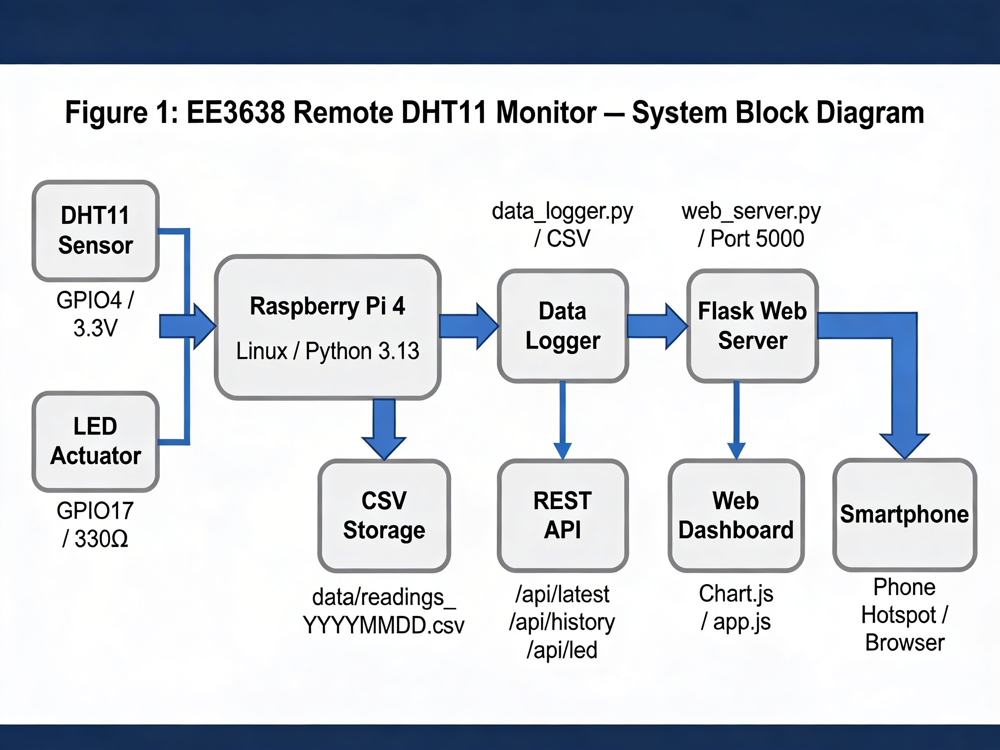
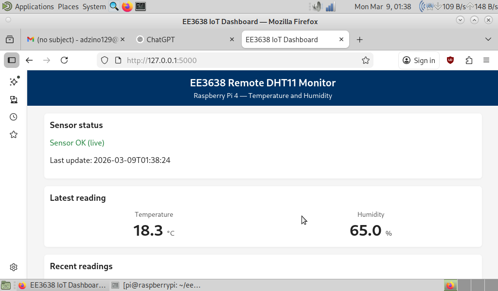
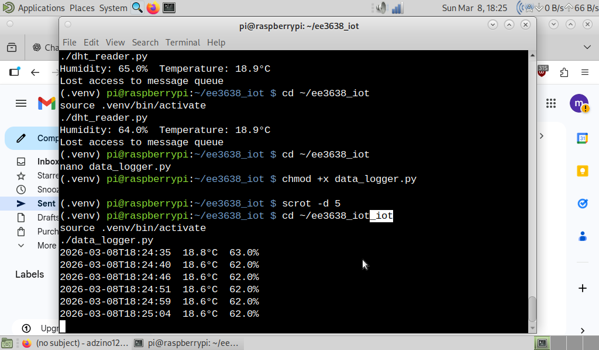
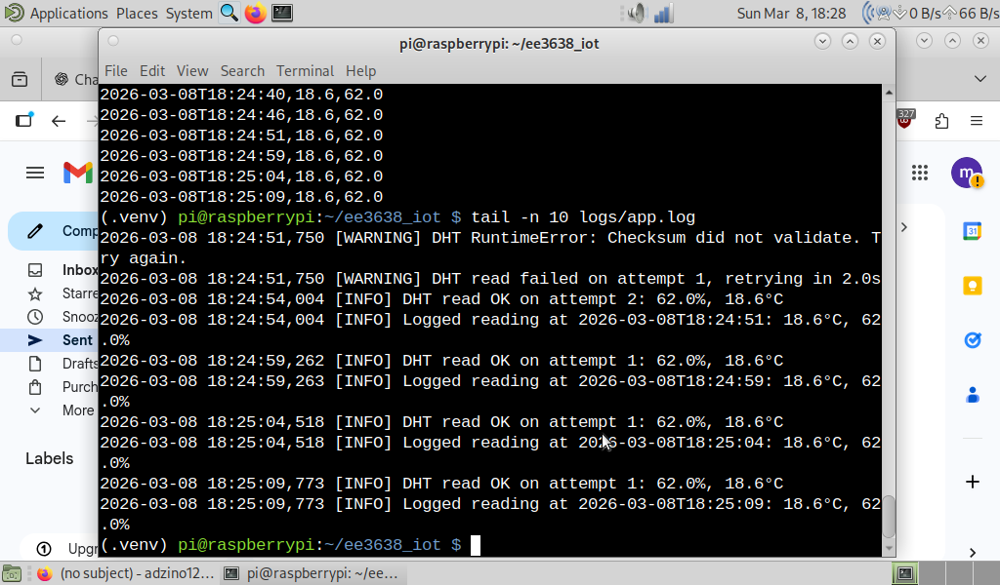
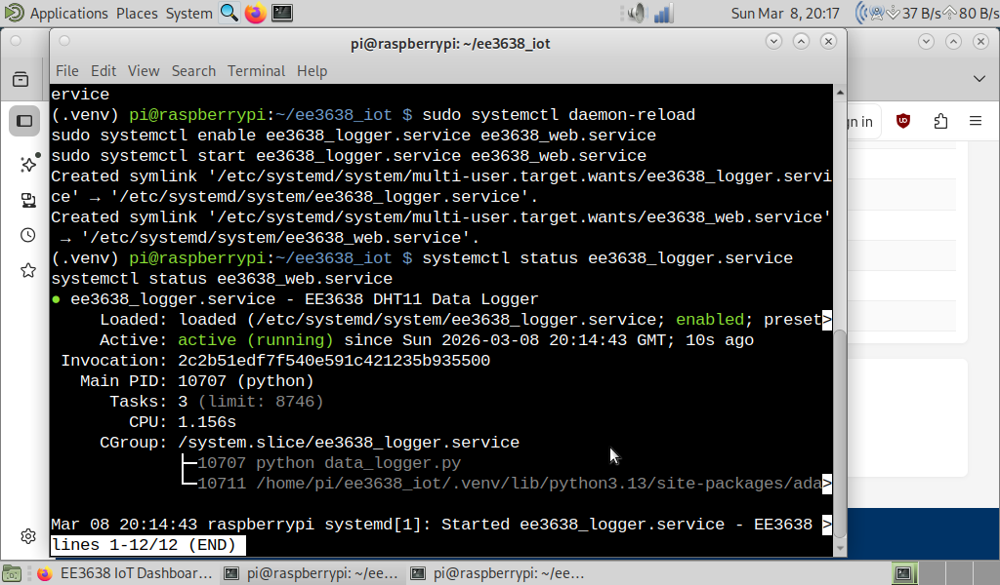
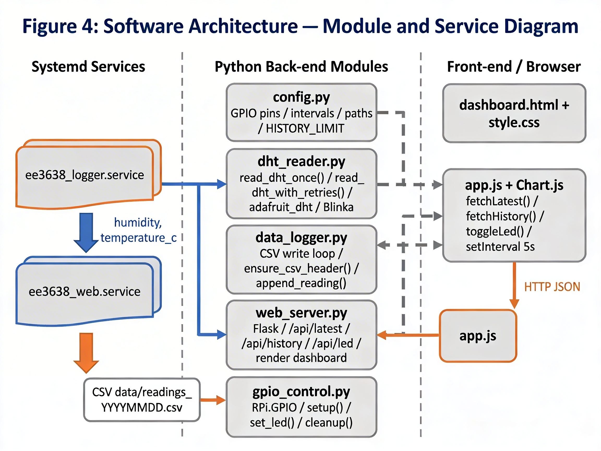

# Raspberry Pi IoT Environmental Monitor

A Raspberry Pi 4 environmental monitoring prototype built for the EE3638 Design for IoT module. The system reads temperature and humidity from a DHT11 sensor, logs timestamped measurements to CSV, exposes live readings through a Flask REST API, visualises recent history with Chart.js, and controls an LED actuator through GPIO.

This repository is structured as a **portfolio and reproducibility repository** for graduate software engineering, embedded systems, and IoT roles. It documents the hardware wiring, software architecture, run instructions, API design, screenshots, and limitations of the working prototype.

## What it demonstrates

- Raspberry Pi 4 hardware integration with a digital DHT11 temperature/humidity sensor
- GPIO input/output using GPIO4 for sensing and GPIO17 for LED actuation
- Python sensor acquisition with retry handling for intermittent DHT read failures
- CSV-based data logging with ISO timestamps and daily log files
- Flask web server exposing live readings, history data, and LED control routes
- Browser dashboard with live values, recent readings, and Chart.js visualisation
- Linux/systemd deployment using separate logger and web server services
- Mobile access over a shared hotspot/local network

## System overview

The project is split into two independent runtime processes:

1. **Data logger service** - owns the DHT11 sensor, reads validated temperature/humidity values, and writes readings to `data/readings_YYYYMMDD.csv`.
2. **Web server service** - serves the dashboard and REST API by reading the latest CSV output rather than directly polling the sensor.

This separation avoids contention around the DHT11 driver and keeps the web dashboard responsive even when the sensor temporarily fails or needs retries.

```text
DHT11 sensor -> dht_reader.py -> data_logger.py -> CSV storage
                                                 -> web_server.py -> REST API -> dashboard.html/app.js
LED actuator <- gpio_control.py <- /api/led POST <- dashboard button
```

## Screenshots and system evidence

### System block diagram

The system uses a Raspberry Pi 4 as the main processing unit. A DHT11 sensor provides temperature and humidity readings through GPIO4, while an LED actuator is controlled through GPIO17. Sensor readings are written to daily CSV files and exposed through a Flask web server, REST API, and browser dashboard.



### Live dashboard on Raspberry Pi

The Flask dashboard displays the latest live reading, sensor status, recent history, and LED control interface.



### Mobile dashboard and LED actuator control

The dashboard was accessed from a smartphone over the same hotspot/local network. The LED actuator could be toggled remotely through the web interface.


### Data logger and structured logs

The logger writes timestamped readings to CSV every five seconds and records retry/success messages for DHT11 reads.





### systemd services running

The logger and web dashboard were configured as separate systemd services so the system could start automatically after reboot.



## Hardware wiring

| Component    | Raspberry Pi connection         | Notes                                 |
| ------------ | ------------------------------- | ------------------------------------- |
| DHT11 signal | BCM GPIO4 / physical pin 7      | Digital temperature and humidity data |
| DHT11 VCC    | 3.3V / physical pin 1           | 3.3V logic level used                 |
| DHT11 GND    | Ground / physical pin 6         | Common ground                         |
| LED anode    | BCM GPIO17 / physical pin 11    | Controlled by dashboard/API           |
| LED cathode  | Ground through 330 ohm resistor | Current limiting                      |

## Software architecture

The software is split into two runtime services: a logger service that owns the DHT11 sensor and writes validated readings to CSV, and a web service that serves the dashboard/API from the CSV output. This avoids direct sensor contention between the logger and web server.



```text
src/
├── config.py        # GPIO pins, polling interval, paths, history limit
├── dht_reader.py    # DHT11 acquisition and retry handling
├── data_logger.py   # CSV persistence loop
├── gpio_control.py  # LED setup and GPIO output control
└── web_server.py    # Flask app, REST API, dashboard routes

web/
├── templates/dashboard.html
└── static/
    ├── app.js
    └── style.css
```

## API endpoints

| Method | Route          | Purpose                                                            |
| ------ | -------------- | ------------------------------------------------------------------ |
| `GET`  | `/`            | Render the dashboard                                               |
| `GET`  | `/api/latest`  | Return the latest logged sensor reading                            |
| `GET`  | `/api/history` | Return recent sensor readings for table/chart display              |
| `GET`  | `/api/led`     | Return current LED state                                           |
| `POST` | `/api/led`     | Set LED state using JSON payload `{"on": true}` or `{"on": false}` |

Example:

```bash
curl http://raspberrypi.local:5000/api/latest
curl http://raspberrypi.local:5000/api/history
curl -X POST http://raspberrypi.local:5000/api/led \
  -H "Content-Type: application/json" \
  -d '{"on": true}'
```

## Local setup on Raspberry Pi

### 1. Clone the repository

```bash
git clone git@github.com:im004/raspberry-pi-iot-environment-monitor.git
cd raspberry-pi-iot-environment-monitor
```

### 2. Create a virtual environment

```bash
python3 -m venv .venv
source .venv/bin/activate
pip install --upgrade pip
pip install -r requirements.txt
```

On Raspberry Pi OS, the Adafruit DHT stack may require system packages:

```bash
sudo apt update
sudo apt install -y python3-dev build-essential libgpiod2
```

### 3. Run a single sensor read

```bash
python src/dht_reader.py
```

Expected output:

```text
Humidity: 65.0%  Temperature: 18.9°C
```

### 4. Run the logger manually

```bash
python src/data_logger.py
```

The logger writes validated readings every 5 seconds to:

```text
data/readings_YYYYMMDD.csv
```

### 5. Run the web dashboard manually

In a second terminal:

```bash
python src/web_server.py
```

Open:

```text
http://127.0.0.1:5000
```

From a phone on the same hotspot/network, use:

```text
http://<raspberry-pi-ip>:5000
```

## Running with scripts

```bash
chmod +x scripts/run_logger.sh scripts/run_web.sh
./scripts/run_logger.sh
./scripts/run_web.sh
```

## systemd deployment

The project includes example service files:

```text
systemd/ee3638_logger.service
systemd/ee3638_web.service
```

Copy them into `/etc/systemd/system/`:

```bash
sudo cp systemd/ee3638_logger.service /etc/systemd/system/
sudo cp systemd/ee3638_web.service /etc/systemd/system/
sudo systemctl daemon-reload
sudo systemctl enable ee3638_logger.service ee3638_web.service
sudo systemctl start ee3638_logger.service ee3638_web.service
```

Check status:

```bash
systemctl status ee3638_logger.service
systemctl status ee3638_web.service
```

The service files assume the repository lives at:

```text
/home/pi/ee3638_iot
```

If your clone path is different, edit `WorkingDirectory` and `ExecStart` in the service files.

## Project report

The coursework report is included in [`docs/report/V2.IMZ.pdf`](docs/report/V2.IMZ.pdf). A concise Markdown summary is available in [`PROJECT_REPORT.md`](PROJECT_REPORT.md).

## Limitations

This is a working educational IoT prototype rather than a production IoT platform.

- The DHT11 is affordable and easy to use, but less accurate and slower than sensors such as BME280 or SHT series sensors.
- CSV logging is simple and transparent, but SQLite or a time-series database would be better for larger deployments.
- The dashboard is served over HTTP without authentication; HTTPS and auth would be needed outside a trusted local network.
- The LED control demonstrates GPIO actuation, but more advanced actuator control would require additional safety checks.
- The system was validated on a local/hotspot network rather than deployed through a public cloud tunnel.

## Future improvements

- Replace DHT11 with a BME280 or SHT sensor for better accuracy.
- Store data in SQLite or a time-series database.
- Add authentication for dashboard access.
- Add HTTPS or reverse proxy deployment.
- Add unit tests for CSV parsing/API formatting.
- Add alerting thresholds for temperature/humidity changes.
- Package the logger and web server with Docker for non-GPIO simulation.

## Portfolio relevance

This project demonstrates practical embedded software skills: hardware wiring, GPIO control, Linux services, sensor acquisition, API design, web dashboards, logging, and engineering trade-offs around reliability. It is especially relevant for graduate roles involving embedded systems, IoT, Linux, Python, automation, hardware/software integration, or full-stack prototyping.
